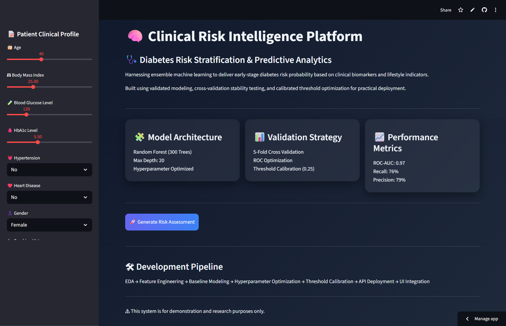
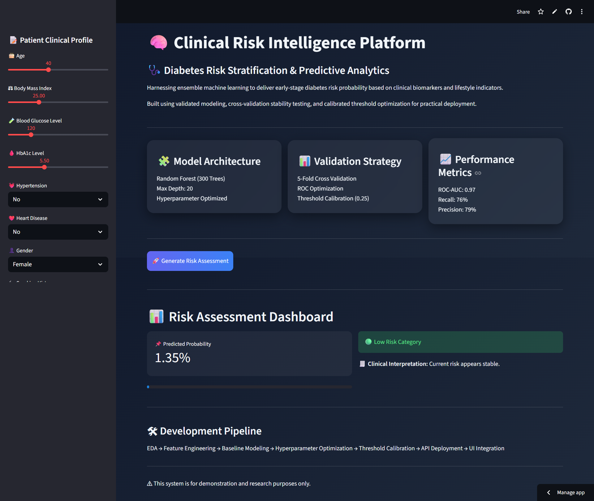

# 🧠 Clinical Risk Intelligence Platform  
## Diabetes Risk Stratification & Predictive Analytics


## ❤️ Diabetes Risk Prediction using Machine Learning  

---

## 🌍 Live Demo  

**Frontend:**  
https://YOUR-STREAMLIT-APP.streamlit.app  

**Backend API Docs:**  
https://YOUR-RENDER-APP.onrender.com/docs  

---

## 📌 Project Overview  

This project builds a complete end-to-end machine learning pipeline to predict the probability of diabetes using structured clinical and lifestyle data.

The workflow includes:

- Exploratory Data Analysis (EDA)  
- Data Cleaning & Duplicate Removal  
- Feature Encoding  
- Logistic Regression Baseline Model  
- Random Forest Comparison  
- Hyperparameter Tuning  
- Threshold Optimization  
- API Deployment using FastAPI  
- Interactive UI using Streamlit  

---

## 📊 Dataset Information  

- 100,000 patient records  
- 8 primary clinical & lifestyle features  
- Binary target variable (`diabetes`)  
- Class imbalance (~8.5% positive cases)  

---

## 🔍 Key Insights from EDA  

- **Blood Glucose Level** and **HbA1c** show strongest correlation with diabetes.  
- High **BMI (>40)** significantly increases risk probability.  
- Hypertension and Heart Disease increase likelihood of diabetes.  
- Dataset imbalance required threshold tuning to improve recall.  

---

## 🧠 Models Evaluated  

| Model | ROC-AUC |
|--------|----------|
| Logistic Regression | ~0.96 |
| Random Forest (Tuned) | **0.972** |

**Final Model:** Tuned Random Forest  
**Optimized Decision Threshold:** 0.25  

---

## 📈 Final Model Performance  

- ROC-AUC: **0.972**  
- Accuracy: **96%**  
- Recall (Diabetes Class): **76%**  
- Precision (Diabetes Class): **79%**  

The threshold was calibrated to improve early detection while maintaining controlled false positives for practical risk stratification.

---

## 📸 Application Preview  

### 🏠 Dashboard  


### 📊 Risk Assessment Result  


---

## 🏗 System Architecture  

Streamlit UI → FastAPI Backend → Tuned Random Forest Model → Risk Probability Output  

---

## ⚙️ Tech Stack  

- Python  
- Scikit-Learn  
- Pandas & NumPy  
- FastAPI  
- Streamlit  
- Render  
- Git & GitHub  

---

## 🚀 Run Locally  

```bash
git clone https://github.com/YOUR_USERNAME/diabetes-risk-prediction.git
cd diabetes-risk-prediction
pip install -r requirements.txt
```

Run backend:

```bash
uvicorn app.main:app --reload
```

Run frontend:

```bash
streamlit run frontend/streamlit_app.py
```

---

## ⚠️ Disclaimer  

This project is for educational and demonstration purposes only.  
It is not a medical diagnosis tool.